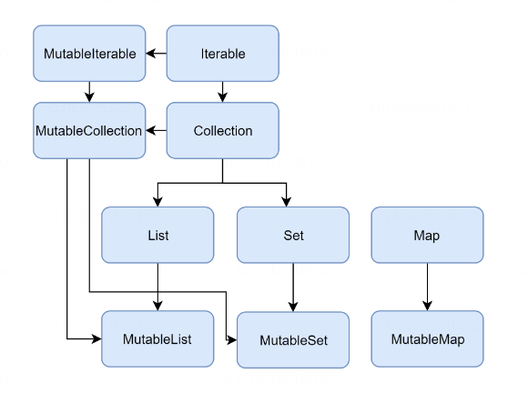
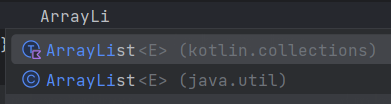

== Коллекции и мапы в Kotlin

link:https://kotlinlang.org/docs/kotlin-tour-collections.html[kotlinlang.org]

*_See:_* link:../../kotlin-basics/src/main/kotlin/common/cs012_collections/KotlinCollections.kt[KotlinCollections.kt]

=== 1. Read-only и Mutable интерфейсы

Стандартная библиотека Kotlin предоставляет реализации базовых типов коллекций: List, Set и Map. Каждый тип коллекции представляет пара интерфейсов:

- *_read-only_* - предоставляющий операции для доступа к элементам коллекции. Это *КОВАРИАНТНЫЕ* коллекции (можно юзать List<Cat> везде, где можно юзать List<Animal>)
- *_mutable_* - расширяет read-only интерфейс операциями записи: add, remove and update elements. Это *НЕ КОВАРИАНТНЫЕ* коллекции (чтобы нельзя было вставить в List<Cat> элемент Dog в случае использования List<Animal>)

В зависимости от интерфейса создании коллекций используются методы вида `{collName}Of()` или `mutable{}Of()`:
[source, kotlin]
----
val lsImmutable: Collection<String> = listOf("one", "two")
val lsMutable: MutableCollection<String> =
    mutableListOf("one", "two")
----

=== 2. Структура коллекций

=== 3. Collection<T>, MutableCollection<T>, iterator

*_Collection<T>_* - корень иерархии коллекций - интерфейс, предоставляющий обычное поведение read-only коллекции (методы `iterator()`/`contains()` и т. д.). +
*_MutableCollection<T>_* - интерфейс, расширяющий Collection<T> методами `add(`)/`remove()`/`clear()` и т. д.

Для таких коллекций существуют свои итераторы - обычный неизменяемый *_Iterator_* и *_MutableIterator_*, который позволяет изменять коллекции.

Пример работы с такими коллекциями (и с итераторами) - *_See:_* link:../../kotlin-basics/src/main/kotlin/common/cs012_collections/KotlinCollections.kt[KotlinCollections.kt]:
[source, kotlin]
----
fun main() {
    val lsImmutable: Collection<String> = listOf("six", "seven")
    printAll(lsImmutable)
    // lsImmutable.add("ten") - нет такого метода

    val lsMutable: MutableCollection<String> = mutableListOf("one", "two")
    lsMutable.add("ten")
    printAll(lsMutable)
    var iter = lsMutable.iterator()
    iter.next()
    iter.remove()
    printAll(lsMutable)
}

fun printAll(strings: Collection<String>) {
    val it = strings.iterator()
    while (it.hasNext()) {
        print("${it.next()} ")
    }
    println()
}
----

=== 4. List и Set

List - интерфейс списка. В Kotlin дефолтная имплементация MutableList - это ArrayList. LinkedList можно взять только чисто из Java

Пример работы с List (и с итераторами) - *_See:_* link:../../kotlin-basics/src/main/kotlin/common/cs012_collections/KotlinCollections.kt[KotlinCollections.kt]:
[source, kotlin]
----
val numbers = ArrayList<String>() // обычно просто mutableListOf()
// immutable to mutable ArrayList
numbers.addAll(listOf("one", "two", "three", "three"))
println("Number of elements: ${numbers.size}") // 4
println("Third element: ${numbers.get(2)}") // three
println("Fourth element: ${numbers[3]}") // three
println("Idx of elem \"two\": ${numbers.indexOf("two")}") // 1

numbers.removeAt(1) // [one, three, three]
numbers.add("four") // [one, three, three, four]
numbers[1] = "twelve" // [one, twelve, three, four]
numbers.shuffle() // перемешали - любой порядок
----

Set - в Kotlin имеет основные 2 реализации - LinkedHashSet и HashSet. Аналогичны реализациям в Java (это вообще type aliases):

[source, kotlin]
----
val numbersSet = setOf(1, 2, 3, 4)
println("Number of elements: ${numbersSet.size}")
if (numbersSet.contains(1)) println("1 is in the set")

val numbersBackwards = setOf(4, 3, 2, 1)
println("The sets are equal: ${numbersSet == numbersBackwards}")

// можно скастить Set к дефолтному LinkedHashSet
val mutableSetInt: LinkedHashSet<Int>? = numbersBackwards as? LinkedHashSet<Int>
// но можно сделать и ерунду
val mutableSetString: LinkedHashSet<String>? = numbersBackwards as? LinkedHashSet<String>
----

Из этого сниппета кода можно извлечь следующее:

- Во-первых, дефолтной реализацией Set - setOf() - является *_LinkedHashSet_*.
- Во-вторых, можно скастить любой интерфейс коллекции к конкретной реализации (как здесь, из Set в LinkedHashSet)
- В-третьих, кастинг параметризованных коллекций небезопасен. Можно запросто скастовать Set<Int> к LinkedHashSet<String>

=== 5. Map

Map также подразделяется на два интерфейса - *_Map<K, V>_* и *_MutableMap<K, V>_*. Как и в случае с Set, дефолтной реализацией Map является *_LinkedHashMap_*. Метод `mapOf()` возвращает LinkedHashMap, но в immutable интерфейсе Map. Метод `mutableMapOf()` возвращает просто LinkedHashMap:

[source, kotlin]
----
val numbersMap =
    mapOf("key1" to 1, "key2" to 2, "key3" to 3, "key4" to 1)

println(numbersMap) // {key1=1, key2=2, key3=3, key4=1}
println("Keys: ${numbersMap.keys}") // [key1, key2, key3, key4]
println("Values: ${numbersMap.values}") // [1, 2, 3, 1]

if ("key2" in numbersMap)
    println("Value by key \"key2\": ${numbersMap["key2"]}") // 2
if (1 in numbersMap.values)
    println("The value 1 is in the map") // in the map
if (numbersMap.containsValue(1))
    println("The value 1 is in the map") // in the map

// casting to linked map
val mutableMap: LinkedHashMap<String, Int> =
    numbersMap as LinkedHashMap<String, Int>
numbersMap.put("default", 0)
mutableMap["key2"] = 7
println(numbersMap) // {key1=1, key2=7, key3=3, key4=1, default=0}
----

=== 6. ArrayDeque

*_ArrayDeque_* - это реализация двусторонней очереди, которая позволяет добавлять или удалять элементы как в начале, так и в конце очереди. Т. е. реализовывает стек и очередь в Kotlin. Реализация ArrayDeque - массив, размер которого изменяется при необходимости:

[source, kotlin]
----
val deque = ArrayDeque(listOf(1, 2, 3))
deque.addFirst(0)
deque.addLast(4)
println(deque) // [0, 1, 2, 3, 4]
println(deque.first()) // 0
println(deque.last()) // 4
deque.removeFirst()
deque.removeLast()
println(deque) // [1, 2, 3]
----
